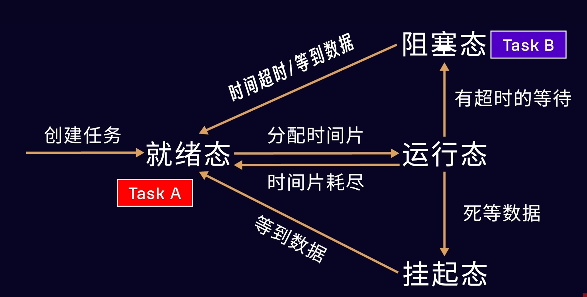

2026.1.19
# FreeRTOS核心知识点总结
[官方网站，可以查看技术文档](https://www.freertos.org/)

## 一、基本概念

### 1. 实时操作系统(RTOS)
- **确定性**：保证任务在确定的时间内完成
- **响应性**：对事件有快速响应能力
- **可靠性**：系统稳定可靠运行

### 2. FreeRTOS特点
- 开源、免费、可裁剪
- 代码量小，最小核心约4-6KB
- 支持多种处理器架构（ARM、MIPS、RISC-V等）
- 丰富的中间件支持

## 二、任务管理（核心）

### 1. 任务状态


### 2. 任务控制块(TCB)
- 存储任务信息（栈指针、优先级、状态等）
- 系统为每个任务维护一个TCB

### 3. 调度策略
- **抢占式调度**：高优先级任务抢占低优先级
- **时间片轮转**：同优先级任务分享CPU时间
- **协作式调度**（可选）：任务主动让出CPU

### 4. 优先级
- 数字越大优先级越高（默认0-31级）
- 系统总是运行**最高优先级的就绪任务**

## 三、任务间通信与同步

### 1. 队列（Queue） - ★最重要★
```c
QueueHandle_t xQueueCreate(UBaseType_t uxQueueLength,  // 队列长度
                           UBaseType_t uxItemSize);     // 项大小
```
- FIFO缓冲区（也支持LIFO）
- 阻塞机制：
  - 队列满时，发送任务阻塞
  - 队列空时，接收任务阻塞
- 解决生产者-消费者问题的关键

### 2. 信号量（Semaphore）
- 二值信号量：任务/中断同步（类似事件标志,即是否）
- 计数信号量：资源管理（如缓冲区数量）

### 3. 互斥量（Mutex）
- 特殊二值信号量
- 优先级继承：防止优先级反转
- 保护共享资源

### 4. 事件组（Event Group）
- 一个任务等待多个事件
- 任意/所有事件触发任务
- 高效位操作

### 5. 任务通知（Task Notification）
- 轻量级通信（单任务）
- 比队列更快，内存占用更少


【新的疑问】：通信协议是啥？
