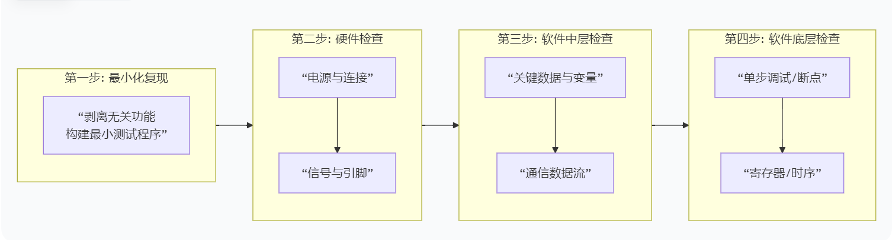

# 一些问题的解答

## 1. 什么是外设？
`外设（Peripheral）是集成在微控制器（MCU）芯片内部`，专门用于处理某项特定输入/输出任务的硬件功能模块。
## 🏰 嵌入式系统核心比喻：计算机的“中央王国”

## 🧠 核心概念
想象你是一个国家的 **国王（CPU/内核）**，住在首都的 **王宫（芯片核心）** 里。你非常聪明（执行指令），但你的手脚伸不了那么远，也看不见王宫外的事情。

**“外设”就是为你服务的各种“总督”、“信使”和“感官”！**

## 📜 外设职能表

| 外设 | 比喻 | 作用 |
| :--- | :--- | :--- |
| **GPIO** | **你的卫兵和传令官** | 你让一个卫兵去点亮灯塔（输出高电平），或者让传令官报告城门是否被触碰（输入检测）。**这是你最直接的控制和感知手段。** |
| **UART (串口)** | **飞鸽传书的信使** | 你想和远方另一个王国（比如ESP32或电脑）通信，就写好信（数据字节），交给信使（UART模块）发送出去。信使负责把信变成一连串鸽子（高低电平），对方收到后再组装成信。 |
| **I2C/SPI** | **宫廷内部的特使和专线** | 王宫里有很多专业大臣：**财政大臣（OLED屏幕）**、**情报官（MPU6050传感器）**、**大厨（温湿度传感器）**。他们各司其职，你通过I2C或SPI这种内部通信协议（好比特定的宫廷礼仪）向他们下达指令或获取信息。 |
| **ADC** | **御用翻译官** | 外面的世界是**模拟的**（比如温度变化是连续的曲线），但国王你只懂**数字的**（0和1）。ADC翻译官的工作就是把模拟世界传来的“感觉”（模拟电压），翻译成你能理解的“数字报告”（比如“温度25度”这个数字值）。 |
| **定时器** | **宫廷钟表官和闹钟** | 钟表官（基本定时器）帮你严格计时。闹钟（定时器中断）会在特定时间响起，提醒你“该上朝了”（执行定时任务），让你不用自己一直数数。 |
| **PWM** | **调光师和调速师** | 你想调节大厅灯的亮度，或控制马车的速度。调光师（PWM模块）通过极快地开关灯（或动力），并调整“开”和“关”的时间比例，来实现平滑的亮度（速度）控制。 |

## 💎 总结
在这个“中央王国”中，**国王（CPU）** 的核心任务是**决策与调度**，而**外设**则是负责执行具体任务的**专业官员**。嵌入式开发的核心，正是学习如何高效地配置并指挥这些“官员”，共同完成复杂的系统功能。


## 2.外设和引脚，到底是软件设置还是硬件规定？
`两者缺一不可，是一个“先硬件规定，后软件配置”的严格过程。 不能用软件随意指定。`

1. 硬件规定（物理限制）：
- 芯片设计时，`每个引脚在硅片上就已经通过物理线路连接到了某个特定的内部电路上。`
- 比如，STM32F103的 PA2 和 PA3 这两个引脚，其内部电路天生就连接着 USART2 的发送（TX）和接收（RX）线路。你无法通过软件把 USART2 的功能变到 PB8 和 PB9 上去（除非它们也支持USART2，这是设计决定的）。
- 这就好比：你家的电视（外设）只能通过墙上那个特定的有线电视接口（专用引脚）接收到信号，你不能把它插到网线接口上然后指望它能看电视。

2. 软件配置（功能选择）：
- `一个引脚除了主要功能，可能还有复用功能。`比如，同一个 PA2 引脚，可以是普通的 GPIO（用来点灯），也可以是 USART2_TX（用来串口发送），还可以是 ADC 的输入通道。
- 你的工作（包括在CubeMX里拖动设置），就是通过软件告诉芯片：“请把这个引脚当前的功能，切换到 USART2_TX 模式。”
- 这就好比：墙上那个接口可能既是电视接口，也是音频输出口。你需要按一下遥控器（软件配置），来切换它是输出电视信号还是音频信号。

总结规律：你能设置的，是芯片设计者允许你设置的那些选项。你不能凭空创造连接。

## 3.手册去哪里看？怎么看？请实操一次！！！
## 芯片手册查阅全攻略

## （1）STM32 芯片手册

### 查找途径
1.  **官网搜索**：进入 **意法半导体 (STMicroelectronics)** 官网 (`st.com`)，在搜索框中输入你的芯片完整型号，例如 `STM32F103C8T6`。在结果中找到 `Datasheet` 和 `Reference Manual`。
2.  **利用CubeMX**：
    *   在STM32CubeMX软件中，点击 `Help` → `Cubemx User Manual`，里面会列出所有官方文档的索引。
    *   在配置引脚时，**直接右键点击该引脚**并选择“查看数据手册”，软件会为你自动打开对应文档。

### 手册类型与用途
*   **数据手册 (Datasheet)**：芯片的“物理简历”。包含**引脚定义图/表、电气特性、封装尺寸**等硬件关键信息。用于**确认引脚功能、设计电路**。
*   **参考手册 (Reference Manual)**：芯片的“功能圣经”。**详尽描述每一个外设（如GPIO, UART, I2C）的工作原理、寄存器配置**。用于**深入编程和调试**。

## （2）ESP32 芯片手册

### 查找途径
进入 **乐鑫科技 (Espressif Systems)** 官网 (`espressif.com`)，在“**文档**”或“**资源**”中心，搜索 `ESP32` 即可找到其**技术规格书 (Datasheet)**。

### 手册特点
乐鑫的文档通常将引脚定义、功能描述、API参考等整合在**技术规格书**和**编程指南**中，结构上可能比ST的文档更集中。

## （3）外部模块手册 (如DHT11、OLED屏)

### 查找途径
1.  **优先找卖家**：购买模块的**店铺页面**通常会提供“资料下载”链接，这是最直接的途径。
2.  **搜索引擎**：使用“**型号 + Datasheet**”的组合进行搜索，例如 `DHT11 datasheet`。
3.  **元器件平台**：在 **拍明芯城**、**立创商城** 等电子元件采购平台，搜索元件型号，其详情页通常都会提供官方数据手册。

### 手册内容
这类手册主要提供**引脚说明、电气参数、通信协议时序图（如DHT11的单总线时序）** 等，是驱动外部设备的关键。

## 💡 如何高效“看”手册（实操建议）

面对几百上千页的英文手册，**不要试图通读**。你的目标是 **“按需查阅，解决问题”** 。

### 典型问题排查步骤（以OLED屏不亮为例）
1.  **定位问题**：我配置了 `I2C`，但 `SDA`/`SCL` 引脚没信号。
2.  **查阅手册**：打开STM32的 **数据手册 (Datasheet)**，翻到**引脚定义表**，找到你用的那两个引脚（例如 `PB6`, `PB7`），在 `Alternate functions` 列确认它们是否真的支持 `I2C1` 功能。
3.  **深入理解**：打开 **参考手册 (Reference Manual)**，找到 **`I2C` 章节**，查看初始化时序要求、时钟配置等寄存器设置细节。
4.  **对比验证**：回到CubeMX，检查你的图形化配置（如时钟速度、引脚模式）是否与手册描述一致。

### 核心思维
**CubeMX等工具已经帮你“翻译”和“执行”了手册里90%的底层配置。你的主要工作，是在遇到无法理解的错误时，学会去手册里找到“标准答案”来验证和调试。**

> 记住：手册是**字典**和**宪法**，不是小说。用它来**查证**和**裁决**，而非通读。

## 4.驱动文件需要自己写吗？还是说用别人的就好了？

- **新手阶段**：**100%使用现成驱动**。用STM32CubeMX生成的HAL库驱动标准外设（I2C、UART），用商家提供的驱动操作具体模块（DHT11、OLED）。
- **进阶阶段**：**打开驱动文件看**。当出现问题时，不要只看调用代码，要进入.c文件看具体的寄存器操作和时序。尝试修改延时、调整配置以适应你的硬件。
- **高手阶段**：**为特定传感器或协议编写驱动**。例如，当你需要最高性能或最低功耗时，可能会为某个传感器从头编写更精炼的驱动。
- **关键**：驱动是“车轮”，你的核心任务是“造车”（系统整合）和“修车”（调试），而不是从炼铁开始。


## 5.遇到问题了，处理的流程是什么呢？先看硬件，再看软件？ 串口和代码的debug到底怎么用呢？


## 🔧 串口Debug vs 代码Debug：你的左右手

这是两种互补的调试手段，用途截然不同：

| 调试手段 | **串口打印 (printf Debug)** | **单步/断点调试 (Debugger)** |
| :--- | :--- | :--- |
| **核心用途** | **监控运行状态、查看历史数据流、长期测试** | **深度解剖逻辑、分析崩溃瞬间、查看内存** |
| **操作方式** | 在代码中插入`printf`，通过USB转TTL在电脑串口助手查看 | 连接ST-Link，在IDE中设置断点，逐行执行 |
| **优点** | **不影响实时性**，能看到程序全速运行的真实情况；能记录历史日志 | 能**暂停时间**，查看任一时刻所有变量、寄存器、内存的值；能精准定位死机点 |
| **缺点** | 大量打印可能拖慢程序；无法查看程序崩溃瞬间的状态 | 会**中断程序实时运行**（定时器、中断、通信时序会受影响） |
| **形象比喻** | **给程序装上一个“黑匣子”和“实时电台”**，事后听录音或实时收听。 | **给程序施加“时间暂停”超能力**，然后仔细检查冻结的世界。 |
| **何时使用** | 检查数据是否送达（如：“ESP32收到：T:25”）、监控循环状态、查找偶发性错误。 | 程序卡死在某个循环、变量值不符合预期、HardFault死机。 |

---

## 🚀 给你的实战操作指南

### 第一步：立刻建立串口Debug能力
这是性价比最高的调试手段。在你的`main.c`里重写好`printf`函数（参考之前的指引），然后在任何怀疑的地方打印：
```c
printf("[DHT11] 开始读取...\n");
result = DHT11_Read(&data);
printf("[DHT11] 读取结果: %d, 温度: %.1f\n", result, data.temperature);
```
### 第二步：学习基本的单步调试
在你的IDE（Keil或CubeIDE）中：
1. 点击行号左侧设置一个断点（程序运行到这会暂停）。
2. 以Debug模式启动程序。
3. 程序暂停后，使用 Step Over (F10) 执行下一行，使用 Step Into (F11) 进入函数内部。
4. 在 Watch 窗口添加你想观察的变量（如 result, data.temperature）