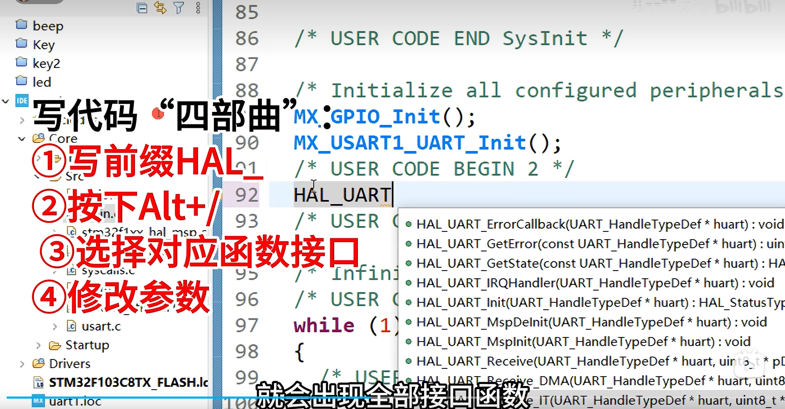

## 1. 对于不知道的函数，该如何查看？
   ```按住Ctrl```，用鼠标左键点击一下 HAL_GPIO_WritePin 这个函数名
## 🎯 工程师的真实工作方式：先快速获取能力，后慢慢消化知识

专业工程师看这类系统源代码时，思维是分层的：

| 你看懂了什么 | 这就足够了！它意味着你知道… | 完全无需深究的部分 |
| :--- | :--- | :--- |
| **函数名和参数** | 这个函数是**设置或清除引脚电平**，需要传入 **哪个端口、哪个引脚、什么状态**。 | `BSRR`寄存器具体每一位如何映射。 |
| **开头的注释块 (`@brief`, `@param`)** | **官方使用说明书**，明确了每个参数的取值范围（如`GPIO_Pin`可以是0-15）。 | 注释的语法细节。 |
| **核心逻辑 `if...else`** | 函数内部就是根据 `PinState` 的值，执行了两个不同的简单操作。 | `BSRR`寄存器左移16位的硬件设计原理。 |
| **`assert_param` 宏** | 这是**参数检查**，如果传入错误参数（如引脚号16）会被捕获。 | 这个宏是如何具体实现断言检查的。 |

**真正需要你100%理解的是：如何使用它。** 例如，知道调用 `HAL_GPIO_WritePin(GPIOA, GPIO_PIN_5, GPIO_PIN_SET)` 就能把PA5引脚设置为高电平。



硬件还没到，就先水一水吧，下载了串口助手，可能还要下载驱动

## FreeRTOS 学习日记

## 🎯 今日任务
配置STM32F103的串口通信基础框架，为后续集成DHT11、MPU6050和ESP32做准备

## 🔧 做了什么 & 作用
### 主要内容：
**串口硬件配置：** 使用STM32CubeMX配置USART1
- **作用：** 建立STM32与电脑的通信通道，用于调试和数据传输

**printf重定向配置：** 实现printf输出到串口
- **作用：** 让C语言的标准输出函数能在嵌入式系统中工作，方便调试和数据显示

**浮点数支持配置：** 启用newlib-nano的浮点数printf支持
- **作用：** 确保DHT11的温湿度数据（浮点数）能正常通过串口输出

**编译环境搭建：** 配置STM32CubeIDE的编译参数
- **作用：** 确保代码能正确编译，特别是printf相关功能

## 🛠️ 实现方法
**步骤1：** 在CubeMX中配置USART1为异步模式，波特率115200，使能中断

**步骤2：** 在main.c中添加_write函数重定向printf到串口

**步骤3：** 在编译器设置中添加-u _printf_float参数启用浮点数支持

**步骤4：** 创建串口测试任务，验证printf功能

### 关键技术点：

**交叉接线：** USB转TTL的TX接STM32的RX，RX接TX

**newlib-nano库：** 嵌入式专用的轻量级C库

**_write系统调用：** printf在newlib-nano中的底层实现

## ⚠️ 遇到的问题

### 问题1：不理解printf重定向原理
**现象：** 对为什么需要写_write函数感到困惑

**原因：** 不理解C标准库在嵌入式系统中的工作方式

**解决：** 通过比喻（快递员改地址）理解重定向本质：把printf从"屏幕输出"改道到"串口输出"

## ✅ 最终成果
**编译成功：** 0错误，1个无关紧要的警告

**代码就绪：** printf重定向代码已添加到main.c

**配置完成：** 浮点数支持已启用，串口中断已配置

**测试程序：** 硬件到后立即可烧录的测试代码已准备好

### 运行现象（预计硬件到后）：

**串口输出：**
```text
================================
   STM32F103 UART 测试程序
   编译时间: Jan 26 2026 22:21:34
================================

测试1 - 整数: 1234
测试2 - 浮点数: PI = 3.1416
测试3 - DHT11模拟数据:
   温度: 25.5°C
   湿度: 60.3%
```

**VOFA+显示：** 在串口助手中能看到格式化数据

**实时性：** 每秒更新一次数据

## 📚 收获与感受
### 技术收获：
1. **嵌入式printf原理：** 理解了标准C库在无操作系统环境下的工作方式
2. **交叉编译配置：** 学会了如何配置编译器和链接器参数满足特定需求
3. **串口通信基础：** 掌握了STM32 USART的基本配置和使用方法

### 经验教训：
1. **软件先行：** 硬件未到时先完成所有软件配置，提高开发效率
2. **理解原理：** 不仅要会"怎么做"，更要理解"为什么这么做"
3. **工具熟悉：** 掌握开发工具（CubeIDE、CubeMX）的各种设置选项

### 个人感受：
> 串口就有点像，你只要用printf就能在屏幕上打印东西，但是嵌入式没有屏幕这一说法，使用串口可以显示在其他软件屏幕上，方便调试吧

