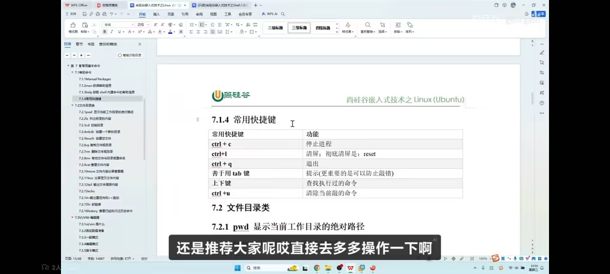

1. 防火墙是用来来管理网络端口的，如果打开就不能访问其他端口
2. sudo  systemctl  status ufw(防火墙)
3. 修改主机名
   - sudo hostnamectl --static set-hostname (name)

4. apt 就是你的大管家，想用啥就下载啥
5. 寻找帮助
   - man
   - help
6. 常用的快捷键
   


# 🧱 防火墙与系统管理笔记

## 1. 防火墙（UFW）

防火墙用于管理网络端口，控制进出系统的流量。  
⚠️ 注意：如果**打开**防火墙但未开放某个端口，则该端口默认**无法访问**。

```bash
# 查看防火墙状态
sudo systemctl status ufw
```

> 补充：  
> - `sudo ufw enable` 开启防火墙  
> - `sudo ufw allow 22` 开放 SSH 端口  
> - `sudo ufw deny 23` 拒绝 Telnet 端口

---

## 2. 修改主机名

```bash
# 静态修改主机名（永久生效）
sudo hostnamectl --static set-hostname <新主机名>
```

> 补充：修改后需重新登录或重启终端才能看到变化。

---

## 3. APT – 你的大管家

APT 是 Debian/Ubuntu 系统中的包管理工具，想用什么软件，它都能帮你下载安装。

```bash
# 更新软件源
sudo apt update

# 安装软件
sudo apt install <软件名>

# 搜索软件
apt search <关键词>
```

---

## 4. 寻求帮助

```bash
# 查看命令的详细手册
man <命令>

# 查看命令的简要帮助
<命令> --help
```

> 补充：`man` 比 `--help` 更详细，按 `q` 退出查看。

---

## 5. 常用快捷键


> 补充常见快捷键：  
> - `Ctrl + C`：终止当前命令  
> - `Ctrl + Z`：暂停当前进程  
> - `Ctrl + D`：退出终端  
> - `Tab`：自动补全命令或路径  
> - `↑ / ↓`：浏览历史命令  

---
