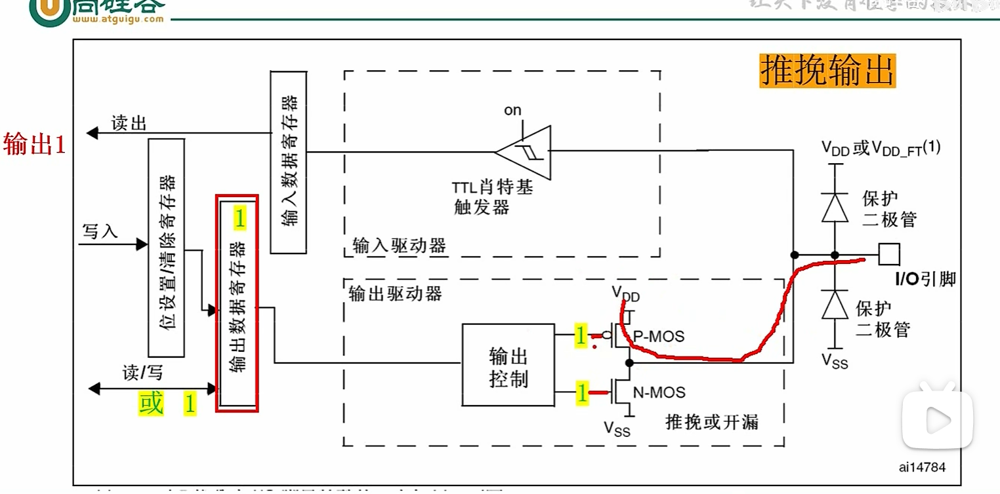
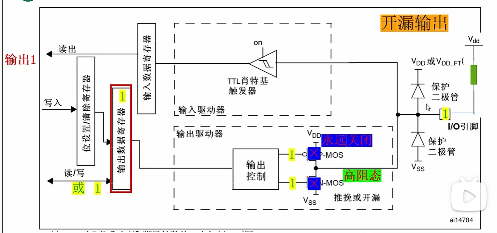

# GPIO（通用输入输出）详解

## 什么是GPIO？

**GPIO**（General-purpose input/output，通用型输入输出）是指我们可以控制输入输出的STM32引脚统称。通过GPIO，微控制器可以与外部世界进行数字信号的交互。

### 基本功能

| 模式 | 描述 | 典型应用 |
|------|------|----------|
| **输出模式** | 控制端口输出高电平或低电平 | 驱动LED、蜂鸣器等 |
| **输入模式** | 读取端口的高低电平 | 读取按键状态、ADC电压采集、通信协议接收数据 |

> **注意**：对于大功率器件（如电机），需要加装驱动器实现**小电流控制大电流**。

---

## GPIO的四种工作模式

GPIO共有四种工作模式，其中输出模式包含两种重要类型：

### 一、输出模式详解

#### 1. 推挽输出模式

**工作原理：**
- 输出寄存器上的 **1** → 激活 **P-MOS** → 输出**高电平**
- 输出寄存器上的 **0** → 激活 **N-MOS** → 输出**低电平**

#### 2. 开漏输出模式

**工作原理：**
- **PMOS永远关闭**
- 输出寄存器上的 **0** → 激活 **N-MOS** → 输出**低电平**
- 输出寄存器上的 **1** → 端口处于**高阻状态**（需外部上拉电阻）

---

## 推挽输出 vs 开漏输出：如何选择？

### 🔋 使用推挽输出的场合

| 序号 | 适用场景 | 说明 |
|:----:|----------|------|
| 1 | **驱动能力需求较高的场合** | 能够直接提供较大的电流 |
| 2 | **高速信号传输** | 电平转换迅速，适合高频通信 |
| 3 | **无需共用信号线的场合** | 避免多个输出直接短路造成损坏 |

> ⚠️ **注意**：推挽输出时，如果多个引脚同时输出不同电平（一些为0，一些为1）并连接在一起，会导致**直接短路烧坏**。

### 🔌 使用开漏输出的场合

| 序号 | 适用场景 | 说明 |
|:----:|----------|------|
| 1 | **多个设备共用信号线** | 支持"线与"连接，多个设备可共享总线 |
| 2 | **不同电压系统之间的接口** | 通过外部上拉电阻（Vdd）可以灵活匹配不同电压 |

> 💡 **提示**：开漏输出配合上拉电阻，可以轻松实现**电平转换**，是I²C等总线协议的理想选择。

---

## 总结对比表

| 特性 | 推挽输出 | 开漏输出 |
|------|----------|----------|
| **输出高电平** | 直接输出Vdd | 需外部上拉电阻 |
| **输出低电平** | 直接输出GND | 直接输出GND |
| **驱动能力** | 强 | 弱（需电阻辅助） |
| **多设备连接** | ❌ 不可共用 | ✅ 支持"线与" |
| **电平转换** | ❌ 不易实现 | ✅ 易于实现 |