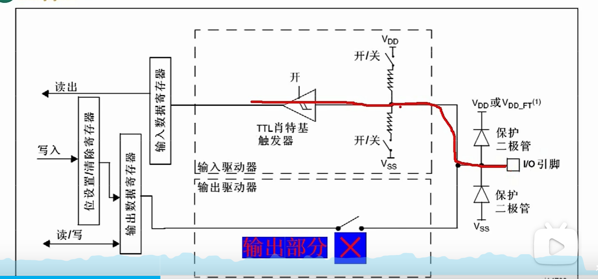

1. 复用功能输出时，原理基本相同
2. 输入模式时：
   - 两个二极管电路是为了稳定读入的电压值，（钳位）
   
   - 两个电阻电路是 当外部悬空时，可以设置默认值，合并上面就为1
   - 施密特触发器就是整波的，防止毛刺
   - 模拟输入就是给片上外设的

3. GPIO 的寄存器：
  - CRL/CRH ：设置工作模式（输入/输出），cnf（通/复用，推挽/开漏），MODE（表示输入输出，速率）
  - IDR/ODR ： 数据寄存器，设置对应位输出高低电平
  - BSRR/BRR ： 来控制ODR的
  - LCKR ： 给CRL/CRH 上锁的

# GPIO 深入详解（进阶篇）

## 一、复用功能输出

**复用功能输出**是指将GPIO引脚分配给片上外设（如USART、SPI、I²C、定时器等）使用。

- **工作原理与通用推挽/开漏输出基本相同**
- 区别在于：输出数据的来源不是CPU直接写入ODR寄存器，而是由**外设模块自动控制**
- 输出模式（推挽/开漏）的选择规则与通用输出完全一致

---

## 二、输入模式详解

输入模式内部结构包含多个关键电路，每个部分都有特定作用：

### 内部结构框图

### 1. 钳位二极管（保护电路）

| 组成部分 | 功能说明 |
|:--------:|----------|
| **两个二极管电路** | 用于**稳定读入的电压值**，实现**钳位保护** |
| **工作原理** | 将输入电压钳位在 VDD 和 VSS 之间，防止过高或过低的电压损坏芯片内部电路 |

### 2. 上拉/下拉电阻（默认电平设置）

| 组成部分 | 功能说明 |
|:--------:|----------|
| **两个电阻电路** | 当外部引脚**悬空**时，可以设置默认电平 |
| **上拉电阻** | 引脚悬空时，默认读取到**高电平（1）** |
| **下拉电阻** | 引脚悬空时，默认读取到**低电平（0）** |

### 3. 施密特触发器（波形整形）

| 组成部分 | 功能说明 |
|:--------:|----------|
| **施密特触发器** | 对输入信号进行**整形**，具有**滞后效应**（阈值电压不同） |
| **主要作用** | **去除信号毛刺**，防止因信号抖动导致的误触发，提高抗干扰能力 |

### 4. 模拟输入（旁路通道）

| 组成部分 | 功能说明 |
|:--------:|----------|
| **模拟输入** | 直接**绕过施密特触发器**，将原始模拟信号送给片上外设 |
| **典型应用** | ADC（模数转换器）采样、模拟比较器等 |

---

## 三、GPIO 寄存器详解

STM32的GPIO功能通过以下寄存器进行配置和控制：

### 1. 端口配置寄存器

| 寄存器 | 全称 | 功能说明 |
|:------:|:----:|----------|
| **CRL** | 配置低寄存器 (Configuration Register Low) | 配置 **Pin 0~7** 的工作模式 |
| **CRH** | 配置高寄存器 (Configuration Register High) | 配置 **Pin 8~15** 的工作模式 |

**CRL/CRH 的配置内容：**

| 配置位 | 作用 | 可选值 |
|:------:|:----:|--------|
| **MODE** | 设置输入/输出模式及输出速率 | 输入(00)、输出(01/10/11对应不同速率) |
| **CNF** | 配置具体功能类型 | 通用推挽、通用开漏、复用推挽、复用开漏、模拟输入、浮空输入、上拉/下拉输入 |

### 2. 数据寄存器

| 寄存器 | 全称 | 功能说明 |
|:------:|:----:|----------|
| **IDR** | 输入数据寄存器 (Input Data Register) | **读取**引脚当前的实际电平状态（只读） |
| **ODR** | 输出数据寄存器 (Output Data Register) | **设置**对应位输出高低电平（可读可写） |

### 3. 位操作寄存器

| 寄存器 | 全称 | 功能说明 |
|:------:|:----:|----------|
| **BSRR** | 端口位设置/清除寄存器 (Bit Set/Reset Register) | **原子操作**：可同时独立设置或清除ODR的某一位，无需担心中断干扰 |
| **BRR** | 端口位清除寄存器 (Bit Reset Register) | **原子操作**：专门用于清除ODR的某一位（部分系列有） |

> 💡 **BSRR的优势**：写操作时，低16位用于**置位**对应位，高16位用于**复位**对应位，一次写入即可同时控制多个引脚，且不会被中断打断。

### 4. 锁定寄存器

| 寄存器 | 全称 | 功能说明 |
|:------:|:----:|----------|
| **LCKR** | 端口配置锁定寄存器 (Lock Register) | 用于**给CRL/CRH上锁**，防止误操作修改引脚配置 |

**LCKR 的作用：**
- 锁定后，CRL/CRH 寄存器的内容将**无法被修改**
- 直到下次**系统复位**才能解锁
- 适用于关键引脚的安全保护

---

## 四、GPIO 配置速查表

| 配置目标 | MODE | CNF | 相关寄存器 | 备注 |
|:--------:|:----:|:---:|:----------:|------|
| 通用推挽输出 | 输出(XX) | 00 | ODR/BSRR | LED驱动、普通输出 |
| 通用开漏输出 | 输出(XX) | 01 | ODR/BSRR + 外部上拉 | I²C等 |
| 复用推挽输出 | 输出(XX) | 10 | 外设控制 | USART TX、SPI SCK等 |
| 复用开漏输出 | 输出(XX) | 11 | 外设控制 + 外部上拉 | I²C的SCL/SDA |
| 模拟输入 | 输入(00) | 00 | ADC | ADC采集 |
| 浮空输入 | 输入(00) | 01 | IDR | 按键输入（外部需上下拉） |
| 上拉/下拉输入 | 输入(00) | 10 | IDR + PUPDR | 按键输入（内部上下拉） |