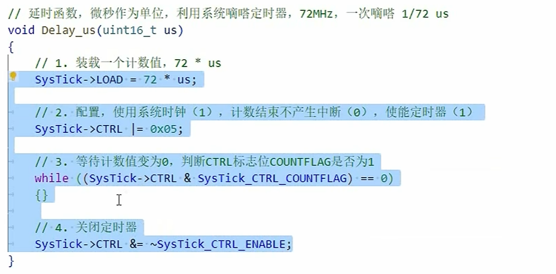

1. 之前已经实现了灯的开关，流水灯就是需要一个延时函数，可以用到系统内部的时钟——滴答定时器
   - 系统的频率为72Mhz 所以每响一次就是1/72 us，72次就是1us


2. 修改了整体的框架，因为对于灯的初始化， 灯的开关，每次使用都会很麻烦，可以直接包装成函数，每次直接调用
   - .h文件的整个套路
   ```
   #ifndef __LED_H
   #define __LED_H

   #endif
   ```
   - 宏定义只是给变量改了个名，它的类型是不变的