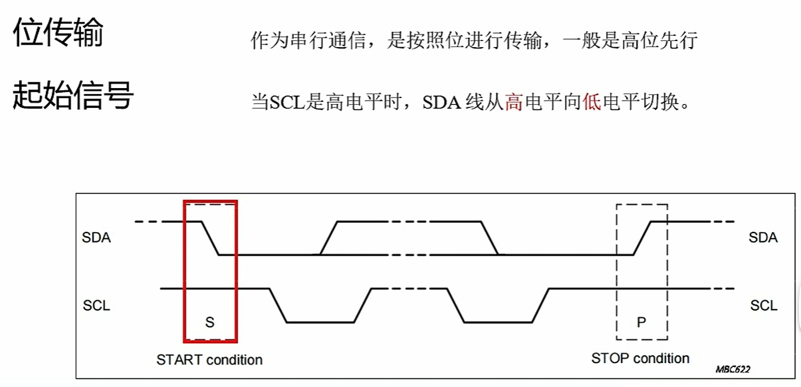
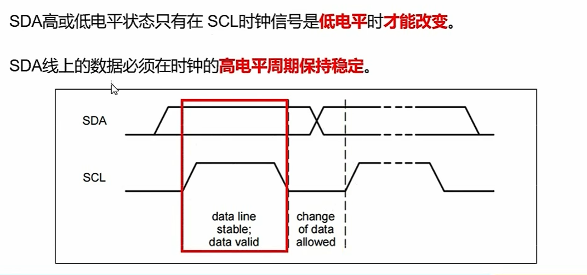
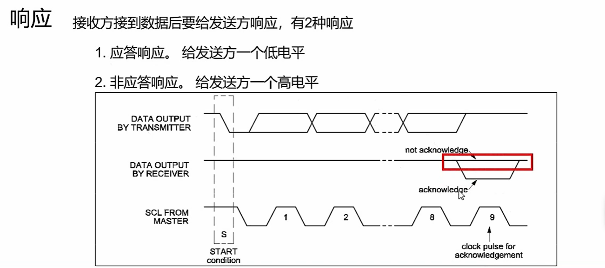

1. IIC  全称 inter integrated circute， 内部集成电路
2. 优点：简单易用成本低，低速通讯，
3. 双向两线，同步串行半双工：SCL，SDA， 因为是只有一根线进行数据的传输，所以是总线模式，使用开漏输出
4. 可以连接一个主设备和多个从设备，当从设备空闲时，就是高阻态输出一，开启时输出0
5. 因为硬件很简单，那相应的通讯协议就会复杂一些，需要解决以下问题
   - 是什么时候开始，什么时候结束（sck高电平时，SDA由高变低代表开始
   - 
   - 从设备的地址（每个设备都有一个自己的地址
   - 是主机读取，还是输入数据（地址 + R/W共八位）
   - 传数据（在sck高电平的时候，看sda的电平，不能发生跳变，但是低电平时可以）
   - 
   - 响应信号，看是否数据传输/接收成功（接收方，在结束时发送一个应答信号，输出零代表接受成功）
   - 

# IIC 总线笔记

## 1. 概述
- **全称**：Inter-Integrated Circuit（内部集成电路）
- **特点**：简单、低成本、低速通讯

## 2. 硬件特性
- **双向两线**：SCL（时钟线）、SDA（数据线）
- **同步、半双工、总线模式**
- **开漏输出**：需外接上拉电阻
  - 空闲时：高阻态 → 高电平（由电阻拉高）
  - 驱动时：输出低电平

## 3. 拓扑结构
- 一个主设备（Master），多个从设备（Slave）
- 每个从设备有唯一地址（7位或10位）

## 4. 通讯协议
由于硬件简单，协议较复杂，主要解决以下问题：

### 4.1 起始与停止条件
- **起始信号（S）**：SCL 高电平期间，SDA 由高 → 低
- **停止信号（P）**：SCL 高电平期间，SDA 由低 → 高

### 4.2 地址与读写控制
- 主机发送 **地址 + 读写位**（共 8 位）
  - 读写位：`0` 表示主机写入，`1` 表示主机读取

### 4.3 数据传输
- **数据有效性**：SCL 高电平时，SDA 必须保持稳定
- **数据变化**：仅在 SCL 低电平时允许 SDA 变化
- 每次传输 8 位数据，高位在前（MSB First）

### 4.4 应答信号（ACK/NACK）
- 每字节后跟随一个应答位
- **ACK（0）**：接收方拉低 SDA，表示成功
- **NACK（1）**：接收方释放 SDA（高），表示失败或结束

## 5. 补充说明
- **多主机**：支持多主竞争与仲裁（通过开漏结构与总线仲裁机制）
- **时钟同步**：多个主机可通过线与机制同步 SCL
- **速度模式**：
  - 标准模式（SM）：100 kbps
  - 快速模式（FM）：400 kbps
  - 高速模式（HS）：3.4 Mbps
  - 超快速模式（UFM）：5 Mbps（仅写）

