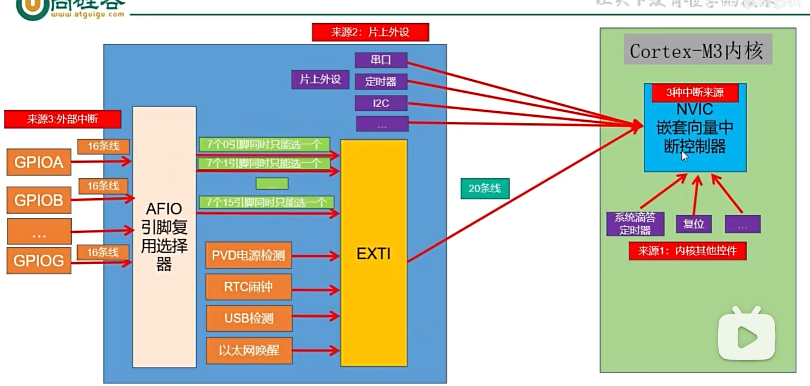
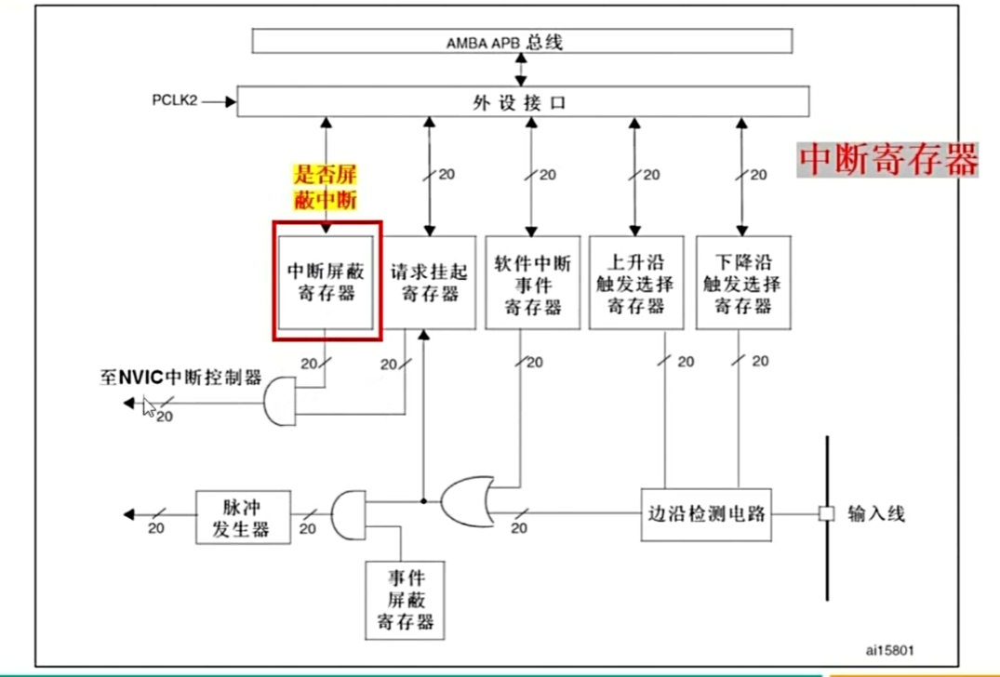

 

1. 任务要求：利用外部中断检测按键KEY3，当按键按下时翻转led
2. 看电路：按键key3 对应的是 pf10，
  - 因为是检测中断 -> 改成输入引脚，由电路图知道，当按键按下时是3.3v, 则平时就是零 -> 配为下拉输入
  - 因为是中断 -> 打开AFIO的时钟，这里比较特别就是，七合一，要让EXTI知道是pF10，还要配置EXTICR3_EXTI10_PF
3. 因为是按下可能会不稳定，所以要进行一个高电平的延时，让输入变得稳定
4. 对于EXIT 要打开PF10对应的中断屏蔽，完成之后还要将中断置位清零