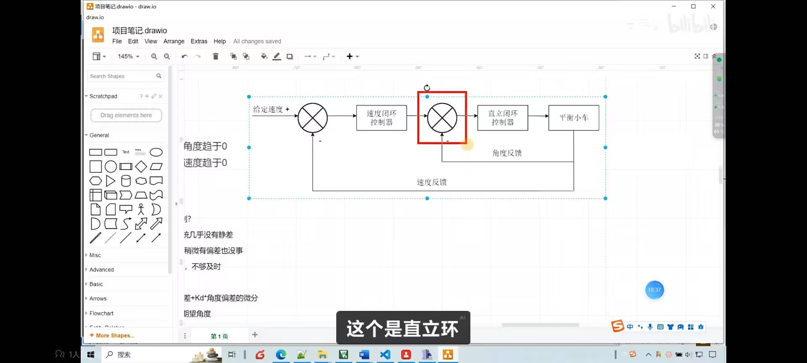
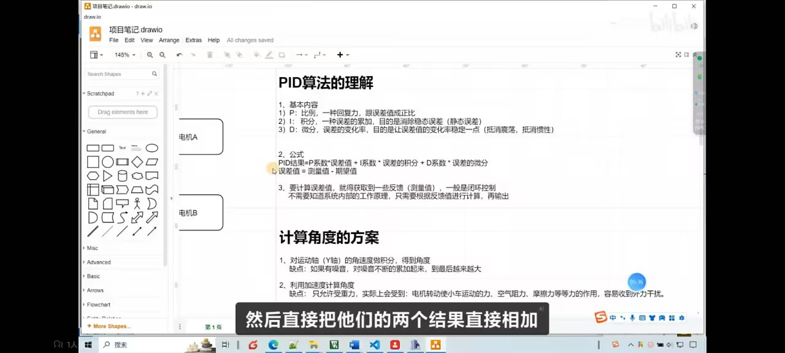

pid的设计方案
1. 首先考虑我们的产品效果：我们想让小车能在静止的时候，保持直立 -> 所以我们要控制两个量： 速度和角度
2. 因为要控制两个量 -> 使用串级pid，pid1的输出，作为2的输入，我们更看重角度环，所以角度环作为pid2
   - 
   - 
3. 对于角度环，我们做pd控制，p是必备的，d是消除惯性的，不做i:稳态误差不大，我们要求的精度不高，-1度也可以（注意面包板的mpu6050一定要水平于地面啊）
4. 对于速度环，我们做pi控制，i是控制惯性嘛，对于速度要求比较精准，不做D，是因为，电机比较容易有噪声，d会放大噪声
5. 对于串级pid，本来是要将1的输出作为2的输入，然后再代入一般的公式进行求解，但是现在带入发现，得到的形式，和两个pid直接相加差不多，所以本项目应该是偷懒使用了直接相加，
6. pid非常需要经验
   - 

# PID 控制方案设计

## 1. 控制目标

让小车在静止状态下保持直立。

**控制量：**
- 速度
- 角度

## 2. 控制结构

采用**串级 PID** 架构：

- PID1（速度环）的输出，作为 PID2（角度环）的输入
- 更看重角度控制 → **角度环作为内环（PID2）**

## 3. 角度环设计 — PD 控制

| 参数 | 选用 | 原因 |
|------|------|------|
| **P** | ✅ 必备 | 核心控制，响应角度偏差 |
| **D** | ✅ 采用 | 消除惯性，抑制振荡 |
| **I** | ❌ 不用 | 稳态误差小，精度要求不高（±1°可接受） |

> ⚠️ **注意**：面包板上的 MPU6050 必须保持水平于地面！

## 4. 速度环设计 — PI 控制

| 参数 | 选用 | 原因 |
|------|------|------|
| **P** | ✅ 必备 | 核心控制，响应速度偏差 |
| **I** | ✅ 采用 | 精准控制速度，消除静差 |
| **D** | ❌ 不用 | 电机噪声较大，D 会放大噪声 |

## 5. 实现说明

理论上，串级 PID 需要将外环输出作为内环输入，代入公式逐级求解。

> 💡 **本项目的简化做法**：  
> 经过推导发现，串级形式与两个 PID 直接相加的结果相近，因此采用了**直接相加**的方式实现。

## 6. 经验总结

> 🎯 **PID 调参非常依赖经验！**

建议调试步骤：
1. 先调角度环的 P，让小车能勉强站立
2. 再调角度环的 D，抑制抖动
3. 最后调速度环的 PI，稳定速度