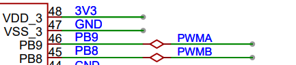
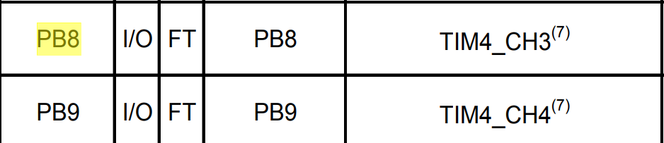
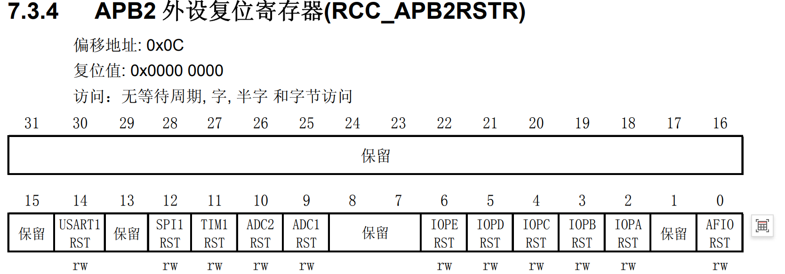
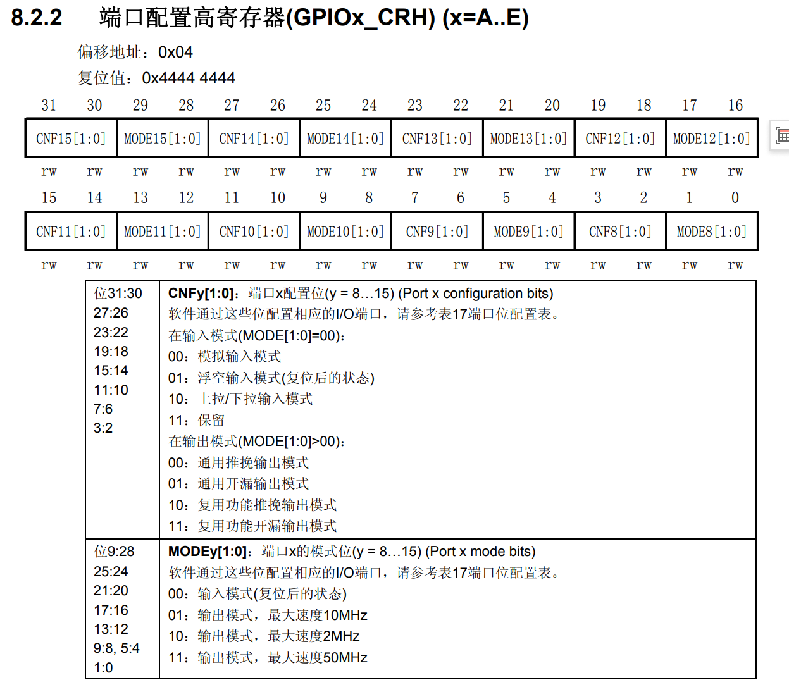
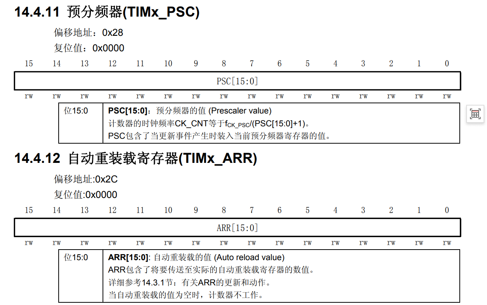
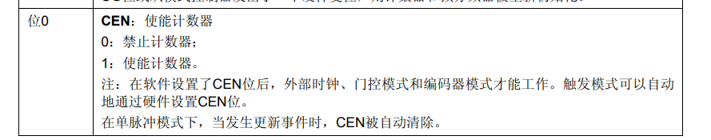
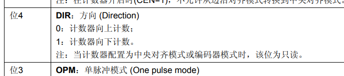
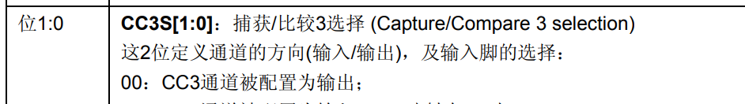

1. 目标：stm32输出pwm信号 -> 通过芯片引脚图，我们可以知道PB8和PB9可以输出pwm信号
   

2. 所以我们去数据手册找PB8和PB9 设置为pwm模式要设置哪个定时器和相关通道
   

3. 配置时钟信号，给定时器4和PB引脚（因为要用他们）
   
   

4. 设置GPIO模式：因为是8，9引脚所以要用crh，设置成复用推免输出，看参考手册
   

5. 配置定时器
   - PWM的频率是多少？ —— 由PSC（预分频器）和ARR（自动重载值）决定
   - PWM的占空比是多少？ —— 由CCRx（捕获比较寄存器）决定
   - PWM的模式是什么？ —— 比如PWM1还是PWM2，极性是高有效还是低有效
   

   

   

   

   


好的，时钟和GPIO配置清楚了，下一步就是配置定时器本身，让它真正开始输出PWM波形。

以你的代码为例，接下来要配置的就是这几部分：

```c
/* 3. 定时器基本通用配置 */
TIM4->PSC = 1 - 1;          // 预分频器
TIM4->ARR = 7200 - 1;       // 自动重装载寄存器
TIM4->CR1 &= ~TIM_CR1_DIR;  // 计数方向（向上计数）

/* 4. pwm模式配置：通道3 */
TIM4->CCR3 = 0;             // 捕获比较寄存器（设占空比）
TIM4->CCMR2 &= ~TIM_CCMR2_CC3S;  // 设为输出模式
TIM4->CCMR2 |= TIM_CCMR2_OC3M_2 | TIM_CCMR2_OC3M_1; // PWM模式1
TIM4->CCMR2 &= ~TIM_CCMR2_OC3M_0;
TIM4->CCER |= TIM_CCER_CC3E;      // 使能通道3输出
TIM4->CCER &= ~TIM_CCER_CC3P;     // 极性：高电平有效

/* 6. 启动定时器 */
TIM4->CR1 |= TIM_CR1_CEN;   // 使能计数器
```

## 按照之前的方法，我们来查这部分

### 第一步：明确要做什么
要让TIM4输出PWM，需要回答三个问题：
1. **PWM的频率是多少？** —— 由PSC（预分频器）和ARR（自动重载值）决定
2. **PWM的占空比是多少？** —— 由CCRx（捕获比较寄存器）决定
3. **PWM的模式是什么？** —— 比如PWM1还是PWM2，极性是高有效还是低有效

### 第二步：打开手册，找到TIM4章节
在参考手册目录中找到"通用定时器（TIM2~TIM5）"章节（通常在14章左右）。

### 第三步：逐个查寄存器

#### 1. 查PSC和ARR（决定频率）
这两个寄存器在定时器章节开头部分：
- **TIMx_PSC**：预分频器寄存器。你的代码里`TIM4->PSC = 1 - 1`，意思是分频系数=1（72MHz输入，分频后还是72MHz）
- **TIMx_ARR**：自动重装载寄存器。`TIM4->ARR = 7200 - 1`，意思是计数周期=7200个时钟周期

**频率计算公式**：  
PWM频率 = 定时器时钟 / (PSC+1) / (ARR+1)  
= 72MHz / 1 / 7200 = 10kHz

#### 2. 查CR1（控制寄存器1）
手册里TIMx_CR1的描述表会告诉你：
- **bit0 CEN**：计数器使能。`TIM4->CR1 |= TIM_CR1_CEN`就是置1这个位，启动计数
- **bit4 DIR**：计数方向。0=向上计数，1=向下计数。`TIM4->CR1 &= ~TIM_CR1_DIR`就是设成向上计数

#### 3. 查CCMR2（捕获/比较模式寄存器2）
这是配置通道3/4模式的关键。手册里这个寄存器的表格会显示：
- **bit14:12 OC3M[2:0]**：通道3的输出比较模式
  - 110 = PWM模式1（计数小于CCR时有效，大于时无效）
  - 111 = PWM模式2（反过来）
- **bit11:8 OC4M[2:0]**：通道4的模式
- **bit0-1 CC3S**：通道3方向选择（00=输出，01/10=输入）

你的代码里：
- `TIM4->CCMR2 &= ~TIM_CCMR2_CC3S` → 把CC3S清0，设成输出模式
- `TIM4->CCMR2 |= TIM_CCMR2_OC3M_2 | TIM_CCMR2_OC3M_1` → 设OC3M的高两位为11
- `TIM4->CCMR2 &= ~TIM_CCMR2_OC3M_0` → 设OC3M的最低位为0  
  合起来就是110（PWM模式1）

#### 4. 查CCER（捕获/比较使能寄存器）
这个寄存器控制每个通道的开关和极性：
- **bit0 CC1E、bit4 CC2E、bit8 CC3E、bit12 CC4E**：对应通道的使能位
- **bit1 CC1P、bit5 CC2P、bit9 CC3P、bit13 CC4P**：对应通道的极性（0=高有效，1=低有效）

你的代码里：
- `TIM4->CCER |= TIM_CCER_CC3E` → 使能通道3输出
- `TIM4->CCER &= ~TIM_CCER_CC3P` → 设极性为高有效

#### 5. 查CCR3（捕获比较寄存器3）
这个就是设占空比的。手册里会写：**占空比 = CCRx / (ARR+1)**。  
你的代码里`TIM4->CCR3 = 0`，初始占空比=0%，所以刚启动时没输出。


## 配置顺序为什么这么排？

手册里虽然没有明确说顺序，但逻辑上是这样的：

1. **先配基本定时参数**（PSC、ARR、计数方向）—— 这些是定时器的心跳
2. **再配每个通道的模式**（CCMRx）—— 告诉硬件这个通道要干输出还是输入
3. **再设初始占空比**（CCRx）—— 避免一使能就输出奇怪的电平
4. **最后使能通道和定时器**（CCER的使能位、CR1的CEN）—— 准备工作做完再启动

你的代码顺序是对的：先PSC/ARR，再CCMR2设模式，再CCER使能，最后CR1启动。

```
|= 1 是把某一位强制变成 1
&= ~1 是把某一位强制变成 0
```

```c
// TIM_CCMR2_OC3M_0 = 0x1000 = 二进制 0001 0000 0000 0000 (bit12=1)
// ~TIM_CCMR2_OC3M_0 = 1110 1111 1111 1111 (除了bit12是0，其他全是1)
// &= 操作：把 bit12 强制设成 0，其他位保持不变
```