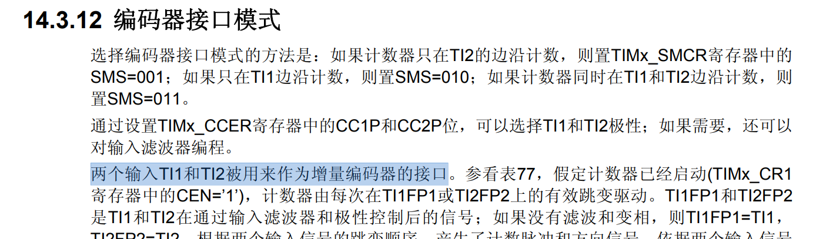
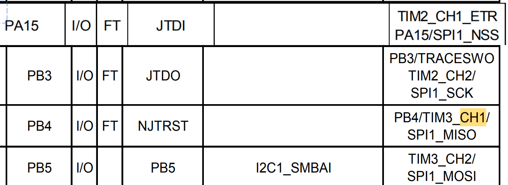
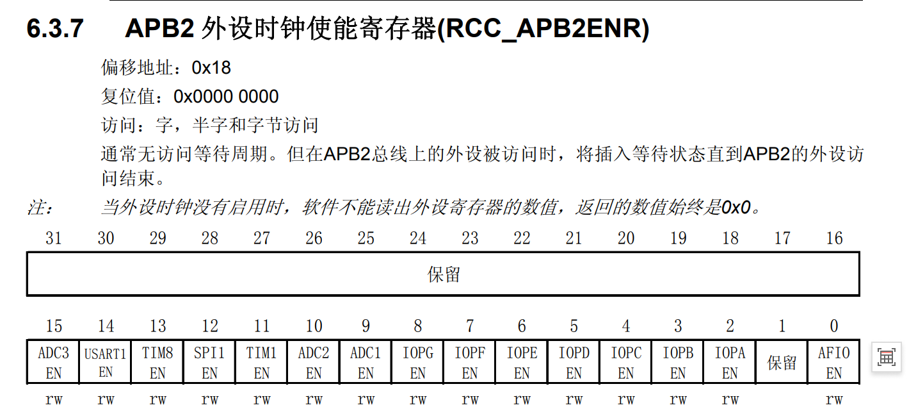
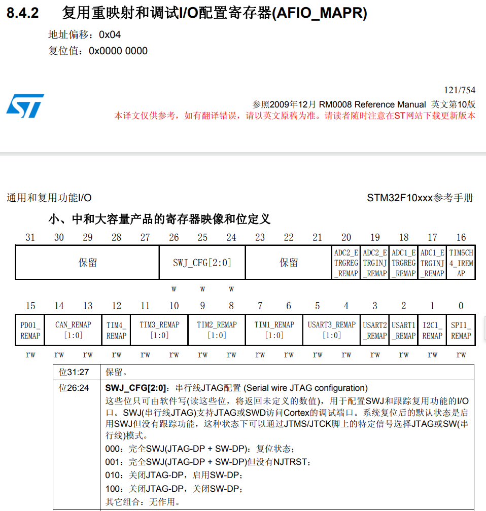
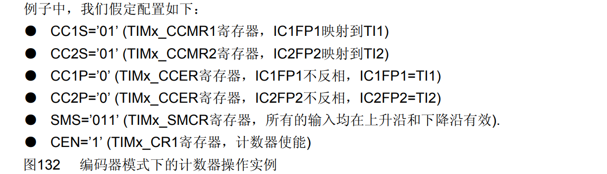
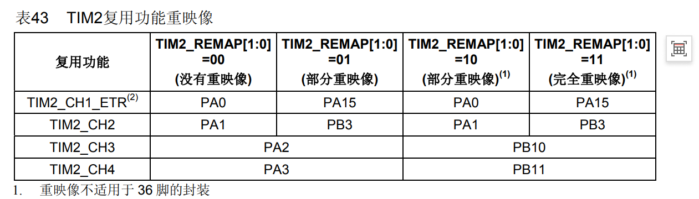
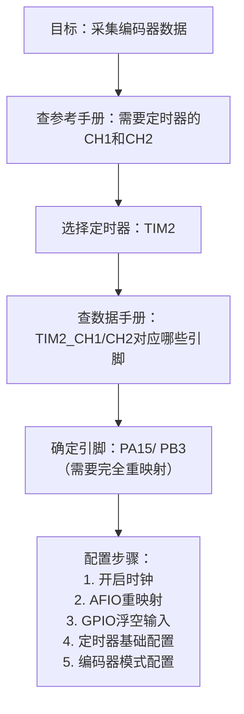

还是希望你自己能理清思路：应该是，stm32 -> tb6612 -> 电机这个过程， 然后涉及到输出和输入两个过程，在了解一下！！！ 
感觉步骤乱乱的


1. 明确我们的目标：让电机的编码器传数据回stm32（知道转速和方向）
   
2. 所以stm32 应该是输入模式 -> 编码器模式 参考手册查到 `一个编码需要两个通道 CH1和CH2，是定时器的通道！！！是在定时器模块找到的`
   - 

3. 选择了可以作为输入通道的引脚，你可以选择不同的定时器，有不同的方案，我们现在选择TIM2，这对应的引脚为PA15和PB3
   - 
   - 
4. 对这个管脚进行初始化，首先要配时钟，GPIO，定时器，编码器模式，需要注意的是这属于重复用功能，还需要用到AFIPO
   - 配时钟：RCC_APB2ENR，要开，定时器TIM2，GPIO的时钟 PA，PB，AFIO时钟
   - 
  
   - GPIO：重映射，然后初始化管脚为浮空输入
   - ![可知要将PA15和PB3，使用复映像功能，则TIM2_REMAP[1:0]=11](image-1.png)
   - 要去AFIO寄存器去配，并且关闭JTAG，打开SWD
   - 

   - TIM2的基本配置（PSC/ARR）
   - 

   - TIM2配置为编码器模式（CCMR/SMCR）
   - 


# 编码器模式配置思路整理

## 一、明确目标
**让电机的编码器传数据回STM32**（获取转速和方向信息）

---

## 二、确定实现方案

STM32需要配置为**输入模式** → **编码器模式**

查阅参考手册得知：
> **编码器模式需要两个通道：CH1和CH2**
> - 这两个通道是**定时器的通道**
> - 编码器功能集成在定时器模块中


---

## 三、选择具体硬件资源

### 3.1 选择定时器
可以选择不同的定时器，有多种方案：
- TIM2
- TIM3  
- TIM4
- ...

**本次选择：TIM2**

### 3.2 确定对应引脚
查阅数据手册，找到TIM2_CH1和TIM2_CH2对应的物理引脚：

| 定时器 | 通道 | 默认引脚 | 完全重映射 |
|--------|------|----------|------------|
| TIM2 | CH1 | PA0 | **PA15** |
| TIM2 | CH2 | PA1 | **PB3** |

**本次接线方案：**
- 编码器A相 → **PA15** (TIM2_CH1)
- 编码器B相 → **PB3** (TIM2_CH2)


---

## 四、初始化配置步骤

### 4.1 开启时钟
需要开启的时钟：
- **定时器TIM2时钟**：RCC_APB1ENR
- **GPIO时钟**：PA、PB（RCC_APB2ENR）
- **AFIO时钟**：用于重映射功能（RCC_APB2ENR）


```c
/* 开启时钟 */
RCC->APB1ENR |= RCC_APB1ENR_TIM2EN;     // 定时器2时钟
RCC->APB2ENR |= RCC_APB2ENR_IOPBEN |     // GPIOB时钟
                RCC_APB2ENR_IOPAEN |      // GPIOA时钟
                RCC_APB2ENR_AFIOEN;       // AFIO时钟（重映射用）
```

### 4.2 重映射配置
TIM2需要配置为**完全重映射**（TIM2_REMAP[1:0] = 11）



```c
/* TIM2完全重映射 */
AFIO->MAPR |= AFIO_MAPR_TIM2_REMAP_FULLREMAP;
```

### 4.3 JTAG/SWD配置
由于PA15和PB3默认是JTAG调试引脚，需要**关闭JTAG，保留SWD**（SWJ_CFG = 010）


```c
/* 关闭JTAG，保留SWD */
AFIO->MAPR &= ~AFIO_MAPR_SWJ_CFG_2;
AFIO->MAPR |= AFIO_MAPR_SWJ_CFG_1;
AFIO->MAPR &= ~AFIO_MAPR_SWJ_CFG_0;
```

### 4.4 GPIO初始化
将PA15和PB3配置为**浮空输入模式**（MODE=00, CNF=01）

```c
/* PA15配置为浮空输入 */
GPIOA->CRH &= ~GPIO_CRH_MODE15;        // MODE=00（输入模式）
GPIOA->CRH &= ~GPIO_CRH_CNF15_1;       // CNF=01（浮空输入）
GPIOA->CRH |= GPIO_CRH_CNF15_0;

/* PB3配置为浮空输入 */
GPIOB->CRL &= ~GPIO_CRL_MODE3;          // MODE=00（输入模式）
GPIOB->CRL &= ~GPIO_CRL_CNF3_1;         // CNF=01（浮空输入）
GPIOB->CRL |= GPIO_CRL_CNF3_0;
```

### 4.5 定时器基础配置

```c
/* 预分频器配置 */
TIM2->PSC = 1 - 1;        // 分频设为1（不分频）

/* 自动重装载寄存器配置 */
TIM2->ARR = 65536 - 1;    // 设为最大值，获得最大计数范围
```

### 4.6 编码器模式配置


```c
/* 4.1 输入通道映射：IC1映射到TI1，IC2映射到TI2 */
TIM2->CCMR1 &= ~TIM_CCMR1_CC1S_1;
TIM2->CCMR1 |= TIM_CCMR1_CC1S_0;     // CC1S=01

TIM2->CCMR1 &= ~TIM_CCMR1_CC2S_1;
TIM2->CCMR1 |= TIM_CCMR1_CC2S_0;     // CC2S=01

/* 4.2 极性配置：不反相 */
TIM2->CCER &= ~TIM_CCER_CC1P;        // CC1P=0
TIM2->CCER &= ~TIM_CCER_CC2P;        // CC2P=0

/* 4.3 编码器模式3：两路信号双边沿计数 */
TIM2->SMCR &= ~TIM_SMCR_SMS_2;
TIM2->SMCR |= TIM_SMCR_SMS_1;        // SMS=011
TIM2->SMCR |= TIM_SMCR_SMS_0;

/* 5. 启动定时器 */
TIM2->CR1 |= TIM_CR1_CEN;            // 使能定时器
```

---

## 五、完整代码

```c
/**
 * 初始化为编码器模式，返回信息给stm32（A电机）
 */
void Dri_TIM2_Init(void)
{
    /* 1. 开启时钟 */
    RCC->APB1ENR |= RCC_APB1ENR_TIM2EN;     // 定时器2时钟
    RCC->APB2ENR |= RCC_APB2ENR_IOPBEN |    // GPIOB时钟
                    RCC_APB2ENR_IOPAEN |    // GPIOA时钟
                    RCC_APB2ENR_AFIOEN;     // AFIO时钟
    
    /* 2. GPIO重映射 */
    /* 2.1 关闭JTAG，保留SWD */
    AFIO->MAPR &= ~AFIO_MAPR_SWJ_CFG_2;
    AFIO->MAPR |= AFIO_MAPR_SWJ_CFG_1;
    AFIO->MAPR &= ~AFIO_MAPR_SWJ_CFG_0;
    
    /* 2.2 TIM2完全重映射：PA15(TIM2_CH1), PB3(TIM2_CH2) */
    AFIO->MAPR |= AFIO_MAPR_TIM2_REMAP_FULLREMAP;
    
    /* 2.3 初始化引脚为浮空输入 */
    /* PA15 */
    GPIOA->CRH &= ~GPIO_CRH_MODE15;
    GPIOA->CRH &= ~GPIO_CRH_CNF15_1;
    GPIOA->CRH |= GPIO_CRH_CNF15_0;
    
    /* PB3 */
    GPIOB->CRL &= ~GPIO_CRL_MODE3;
    GPIOB->CRL &= ~GPIO_CRL_CNF3_1;
    GPIOB->CRL |= GPIO_CRL_CNF3_0;
    
    /* 3. 定时器基础配置 */
    TIM2->PSC = 1 - 1;              // 预分频：1（不分频）
    TIM2->ARR = 65536 - 1;           // 自动重载：最大值
    
    /* 4. 编码器模式配置 */
    /* 4.1 输入映射：IC1->TI1, IC2->TI2 */
    TIM2->CCMR1 &= ~TIM_CCMR1_CC1S_1;
    TIM2->CCMR1 |= TIM_CCMR1_CC1S_0;
    
    TIM2->CCMR1 &= ~TIM_CCMR1_CC2S_1;
    TIM2->CCMR1 |= TIM_CCMR1_CC2S_0;
    
    /* 4.2 极性配置：不反相 */
    TIM2->CCER &= ~TIM_CCER_CC1P;
    TIM2->CCER &= ~TIM_CCER_CC2P;
    
    /* 4.3 编码器模式3：双边沿计数 */
    TIM2->SMCR &= ~TIM_SMCR_SMS_2;
    TIM2->SMCR |= TIM_SMCR_SMS_1;
    TIM2->SMCR |= TIM_SMCR_SMS_0;
    
    /* 5. 启动定时器 */
    TIM2->CR1 |= TIM_CR1_CEN;
}
```

---

## 六、使用示例

初始化后，通过读取`TIM2->CNT`获取编码器计数值：

```c
/* 读取当前计数值（带符号的16位数据） */
int16_t encoder_value = (int16_t)TIM2->CNT;

/* 清零计数值（例如每10ms读取一次后清零）*/
TIM2->CNT = 0;
```

---

## 七、思考流程总结



---

## 八、关键点总结

| 步骤 | 内容 | 依据 |
|------|------|------|
| 1 | 编码器需要两个通道 | 参考手册"编码器接口模式"章节 |
| 2 | 选择TIM2 | 硬件资源可用性 |
| 3 | 引脚为PA15/PB3 | 数据手册"Pinouts"表 + 重映射配置 |
| 4 | 关闭JTAG | PA15/PB3被JTAG占用 |
| 5 | 浮空输入 | 编码器信号为外部输入 |
| 6 | 编码器模式3 | 双边沿计数，精度最高 |